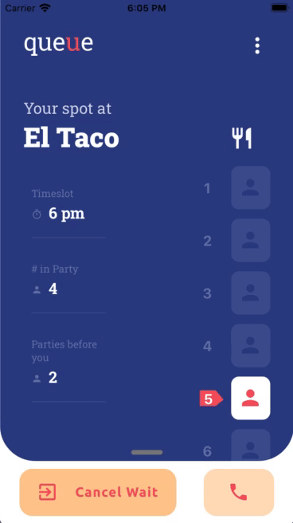

*Read this in other languages: [Portuguese](README.md), [English](README.en.md).*

# Sobre o projeto

O objetivo foi replicar em React Native a mesma interface criada no Adobe XD pela designer Andrea Hock (https://dribbble.com/shots/8217150--Restaurant-Waitlist-Mobile-App). Achei a interface muito linda e tomei como um desafio deixar o mais parecido possível.

Os icones e as fontes usadas não são as mesmas porque não eu tenho as licenças para utilizar, mas tentei deixar o mais fiel possível com as gratuitas disponiveis online.

## Feito com

Abaixo segue as principais dependencias usadas na criação deste projeto:

- [React Native](http://facebook.github.io/react-native/)
- [Styled Components](https://www.styled-components.com)
- [React Native Gesture Handler](https://github.com/software-mansion/react-native-gesture-handler)
- [React Native Vector Icons](https://github.com/oblador/react-native-vector-icons)
- [React Native Circular Progress](https://github.com/bartgryszko/react-native-circular-progress)

Usei o ESLint como ferramenta de lint para JavaScript e JSX (https://eslint.org/) e o template da Rocketseat (https://github.com/Rocketseat)

## Projeto

O conceito é um app de lista de espera para restaurantes. A ideia é que o cliente consiga acompanhar quando a mesa está disponível.

Para simular a fila andando, eu coloquei um setTimeout que executa a rotina de checar a fila da lista de espera num determinado tempo aleatorio entre 1 e 10 segundos, assim será possível visualizar a animação.



## Para rodar na sua máquina

1.  Clone o repositorio:

```
git clone https://github.com/leandrorss/queue.git
```

2.  Instale as dependencias:

```
cd queue
yarn install
```

3.  Rode o app:

```
npm run ios
npm run android
```
